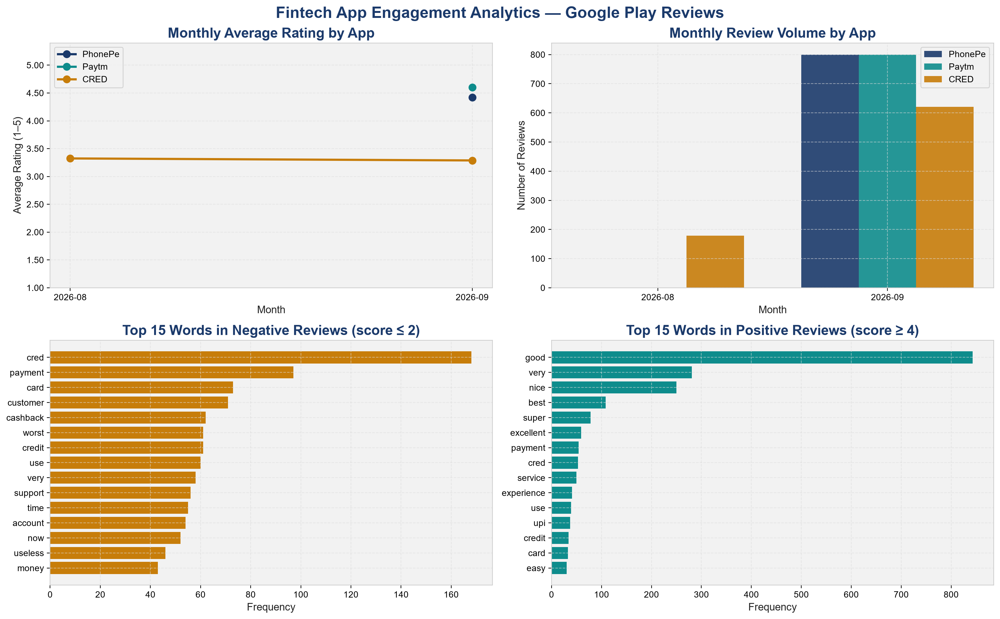
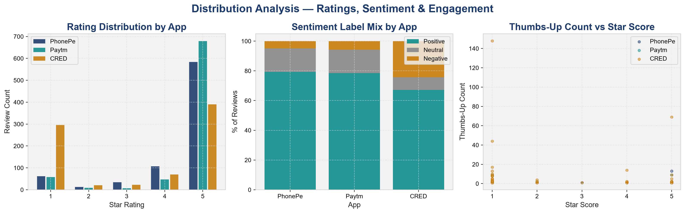

# Fintech App Engagement & Retention Analytics

An analysis of 2,400 Google Play Store reviews of three Indian fintech apps — **PhonePe, Paytm and CRED** — to find out what actually drives user satisfaction, and to turn that into product recommendations.

## Why I built this

I completed my MBA in Financial Technology, and I wanted a project rooted in the domain I trained in — not a generic dataset with no business context. Instead of downloading a ready-made dataset, I collected my own: live Play Store reviews for three apps I use every day. Star ratings only tell you *how* users feel; the review text tells you *why*. That "why" is what this project is about.

## Problem statement

Which experiences drive positive versus negative sentiment across PhonePe, Paytm and CRED — and what should each product team fix first?

## Dataset

- **Link:** [`data/fintech_app_reviews_raw.csv`](data/fintech_app_reviews_raw.csv)
- **Source:** Google Play Store reviews (India), collected with the [`google-play-scraper`](https://pypi.org/project/google-play-scraper/) Python library
- **Size:** 2,400 reviews — 800 per app, newest first
- **Period:** 25 Aug 2026 – 22 Sep 2026
- **Columns used:** `content`, `score`, `at`, `thumbsUpCount`, `app_name`

**A limitation I had to account for:** since I collected the newest 800 reviews per app, almost all of them fall in September. My first pass read this as a "12× engagement surge" — it was really a sampling artifact, so I removed that claim. The findings below rely only on comparisons that this sampling doesn't distort.

## Approach

1. **Cleaning** — removed duplicates and empty reviews, parsed dates, and stripped URLs, emojis and punctuation from the review text
2. **Sentiment** — VADER, a lexicon-based model that suits short review text and gives explainable scores without needing labelled training data
3. **KPIs** — average rating, % negative, % positive, average sentiment and rating volatility (σ), overall and per app
4. **Vocabulary analysis** — most frequent words in negative (≤ 2★) vs positive (≥ 4★) reviews
5. **Deeper diagnostics** — rating and sentiment distributions, a negative-review classifier, and the UPI MDR policy as market context
6. **Fact → Insight → Action** — each finding converted into a specific product recommendation

## Key findings

| App | Avg rating | % Negative | % Positive | Rating volatility (σ) |
|---|---|---|---|---|
| Paytm | 4.60 | 8.4% | 90.8% | 1.09 |
| PhonePe | 4.42 | 9.4% | 86.4% | 1.17 |
| CRED | 3.30 | 39.6% | 57.5% | 1.86 |

1. **Paytm and PhonePe lead on satisfaction**, and their sentiment scores (0.35 / 0.36) confirm the praise in the text matches the stars.
2. **CRED's core promise isn't landing.** "Cashback" appears 62 times in its negative reviews — the single loudest complaint.
3. **The gap is about trust, not features.** CRED's complaints centre on broken cashback promises; Paytm and PhonePe's praise centres on reliable UPI payments.
4. **CRED's experience is polarised, not uniformly bad.** Its volatility (σ = 1.86) is far above the other two — some users love it, many don't, which points to a specific segment problem that can be fixed.
5. **UPI MDR makes trust worth money.** From 15 Oct 2026, merchant UPI payments above ₹2,000 carry a 0.4% MDR — the first real revenue on UPI since 2020. Large payments go through apps users trust, so the trust gap becomes a revenue gap.

### About the classifier

I trained a TF-IDF + Logistic Regression model to flag negative reviews from text alone. It scores **90.6% accuracy** — but that number is misleading. Around 87% of the test set is positive, so a model that always says "positive" would already score ~86.5%. The metric that matters for flagging complaints is **negative-class recall, which is only 34%** — it misses two out of three real negative reviews. I report it as a proof of concept, not a production tool. Class balancing is the next step.

## Recommendations

- **CRED:** add a real-time cashback tracker, shorten redemption to 48 hours, and send milestone notifications — aiming for a 4.0+ rating within two release cycles.
- **CRED:** break down reviews by user cohort to find which segment drives the negative experiences, then target that segment.
- **All three apps:** "customer" and "support" are top complaint words everywhere — introduce tiered support SLAs and show ticket status in-app.

## Tech stack

Python · pandas · NumPy · VADER Sentiment · scikit-learn · matplotlib · Jupyter Notebook

Development environment: IBM Bob (AI-assisted IDE), used for coding support; the problem framing, data collection, analysis decisions and validation are my own.

## How to run

```bash
git clone https://github.com/KarishmaMekaliya/fintech-app-engagement-analytics.git
cd fintech-app-engagement-analytics
pip install -r requirements.txt
jupyter notebook Karishma_Mekaliya_FintechEngagementAnalytics.ipynb
```

Run all cells from top to bottom. The notebook reads the CSV from `data/` and saves every chart into `charts/`.

## Project structure

```
├── Karishma_Mekaliya_FintechEngagementAnalytics.ipynb   # full analysis
├── Karishma_Mekaliya_ProjectReport.docx                 # project report
├── requirements.txt
├── README.md
├── data/
│   └── fintech_app_reviews_raw.csv
└── charts/
    ├── 01_ratings_volume_top_words.png
    ├── 02_rating_sentiment_distribution.png
    ├── 03_classifier_confusion_matrix.png
    └── 04_upi_mdr_value_concentration.png
```

## Charts




## Author

**Karishma Mekaliya** — MBA (Financial Technology), Shri Vaishnav School of Management  
[LinkedIn](https://linkedin.com/in/karishma-mekaliya) · [GitHub](https://github.com/KarishmaMekaliya)
